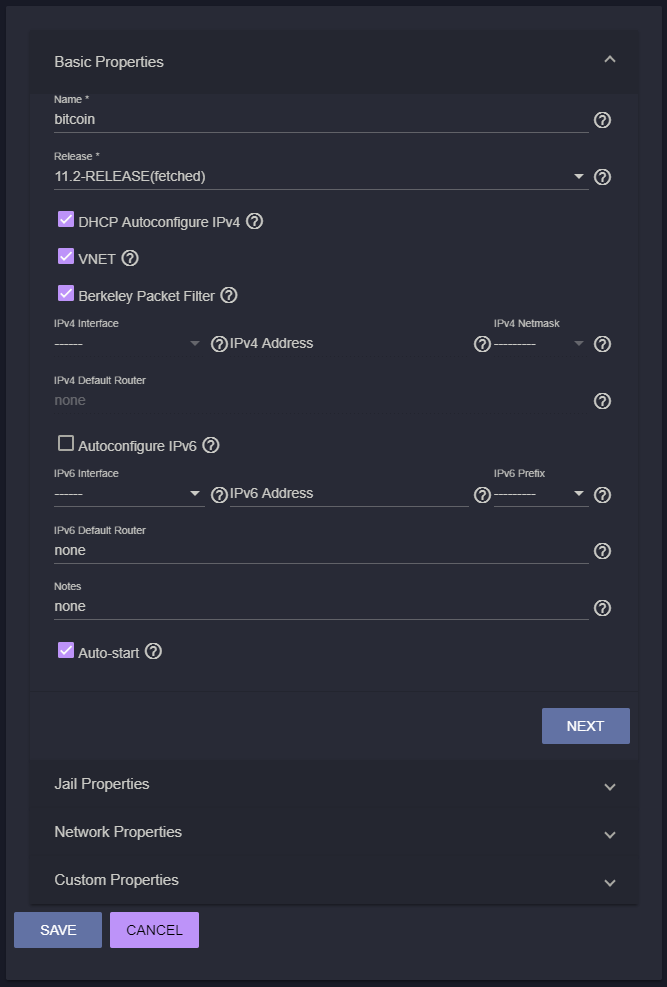

[ [Intro](README.md) ] - [**Jail Creation**] - [ [Bitcoin](freenas_2_bitcoin.md) ] - [ [Tor](freenas_3_tor.md) ] - [ [Electrum](freenas_4_electrum.md) ] - [ [lnd](freenas_5_lnd.md) ] - [ [RTL](freenas_6_rtl.md) ] - [ [Joule](freenas_7_joule.md) ]

### Guide to ₿itcoin & ⚡Lightning️⚡ on 🦈FreeNAS🦈

### Jail Creation

Think of jails as more efficient virtual machines (VMs). You could just install a bunch of VMs on FreeNAS, run linux on them, and pick your choice on the many varieties of linux guides available online. But running a VM requires a lot more resources than jails, allocating memory just for that VM, etc. Plus, if we mess up, we can delete the jail and start over. Anything we do in the jail should not mess up anything on the host machine. After all, we built a computer with server grade hardware for the uptime!

FreeNAS 11.2 uses iocage to manage jails. Previous versions used warden, which is now considered deprecated. To create a jail, log in to your FreeNAS user interface, and select Jails on the left hand menu. Click the ‘+’ symbol on the top right, and give your jail a name. I decided to call mine `bitcoin_node` . Under release, select `11.2-RELEASE` . Click ‘next’.

  
