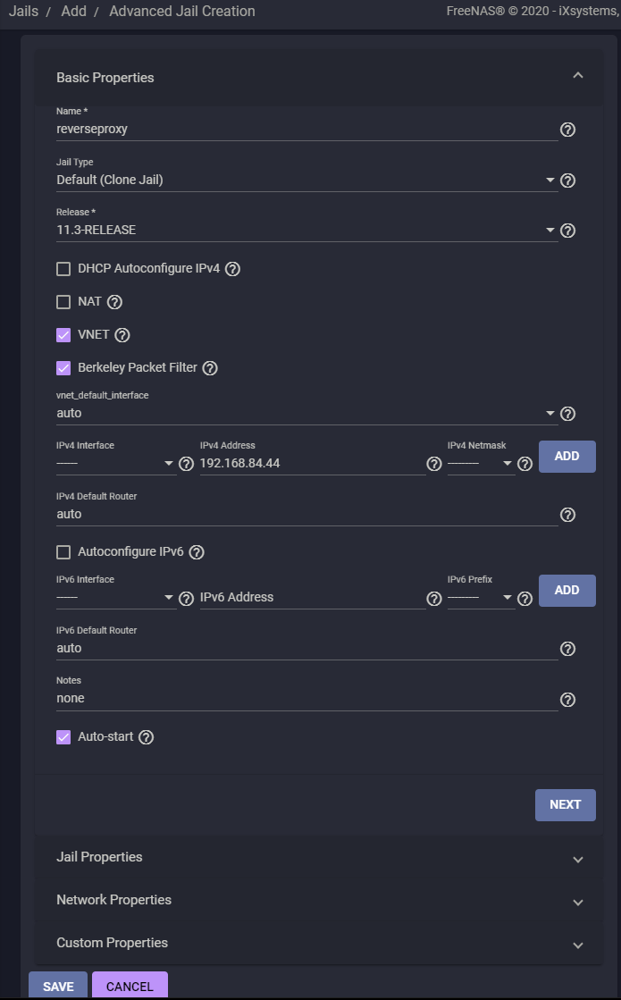
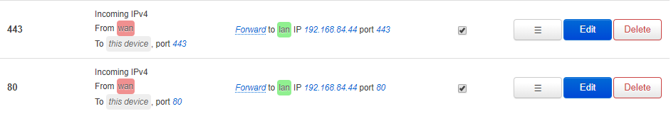
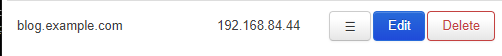

[ [<< Back to Main Menu](https://github.com/seth586/guides/blob/master/README.md) ]

## Guide to a self hosted wordpress website on FreeNAS/TrueNAS 
[ [Intro](README.md) ] - [ [Jail Creation](1_jail_creation.md) ] - [ [nginx](2_nginx.md) ] - [ [mysql](3_mysql.md) ] - [ [PHP](4_php.md) ] - [ [wordpress](5_wordpress.md) ] - **[reverse proxy]**

A reverse proxy / load balancer stands between the client and your servers. It allows you to host multiple websites from the same IP address and even same port! Our reverse proxy will also offer SSL/TLS termination, such as wildcard.sampledomain.com or sampledomain.com.

Good video of a different solution using cloudflare [here](https://www.youtube.com/watch?v=LlbTSfc4biw)

## 1. Create a new jail
Login to the TrueNAS web-ui. Create a new jail with a static IP address outside the range of your routers DHCP IP range. The default DHCP range on openwrt is 192.168.0.100 thru 192.168.0.254, I will use 192.168.84.44 as an example.



## 2. Router Configuration
Forward ports 443 and 80 to your reverseproxy jail in your router.



## 3. Create AWS Route 53 user with minimum permissions

In this example we will use certbot with the Amazon Route 53 plugin for our domain name server. For other dns providers using this method run `pkg search certbot` to see a list of provider plugins. This list is not exhaustive, there are many different ways to obtain and renew SSL/TLS certificates, refer to documentation provided by your domain provider.

For security reasons we will create an aws user with minimum permissions to maintain your domain with an SSL/TLS certificate and update recordsets with a dynamic dns.

At this point you should have sucessfully registered a domain on Amazon's Route 53. Login to your Amazon Web Services as a root user. Bring up the "services" menu on the top left, and under "Security, Identity, & Complaince" click on IAM to bring up the "Identity and Access Management" dashboard. Click "Policies" on the left menu, then click "Create Policy". We can build the permissions thru the visual editor:

Under "Service" select "Route 53"
Under "Actions" select the following permissions required by [documentation for certbot's route 53 plugin](https://certbot-dns-route53.readthedocs.io/en/stable/):  

route53:ListHostedZones route53:GetChange route53:ChangeResourceRecordSets route53:ListResourceRecordSets

Under Resources select "All resources". Click "Review Policy". Give the policy a name, I used `certbot`. Write a description to remind you what its for: "Policy so my ddns can update my webservers IP address and my reverse proxy can request and renew SSL and TLS certificates". Click "Create policy". You should now have the "certbot" policy in your "Policies" list.

Now lets create a user with this policy. Click "Users" on the left menu. Click "Add user". Lets call it `reverseproxy`. Under "access type*" select "Programmatic access". Click "Next: Permissions". Click "Attach existing policies directly" and search for your "certbot" policy. Click the checkmark to the left of "certbot". Click "Next: Tags". Click "Next: Review". Click "Create User". Write down the Access key ID and Secret access key, and store this information in a safe place. Click "close". You should now see the user "reverse proxy" listed in your user list.

## 4. Set up Dynamic DNS on OpenWRT with domain provider AWS Route 53

The Domain Name System converts "domains" to IP addresses. If your internet service provides a static IP address, you can skip this step. Just make sure you create a "type A record set" with your domain pointing to your static home IP address. However, most ISPs dynamically assign IP addresses. So lets install some software that will automatically update your "type A record set" for your domain as your home IP address changes.

Log into your OpenWRT router and select "System ▼", "Software". Click "Update lists". Under "Filter" type in `ddns-scripts`. Click "Install" next to `ddns-scripts` and `ddns-scripts_route53-v1` if you use AWS Route 53 for your domain management. Click "System ▼", "Reboot".

The UI is useful here but not completely. As of writing some authentication fields are missing, so SSH or WinSCP into your router and edit `/etc/config/ddns`: Replace `lookup_host`, `username`, `password`, and `domain` with your specific values:
```
config service 'aws'
	option service_name 'route53-v1'
	option lookup_host 'example.com'
	option username 'BJIA3YD4TV7OO9Y2BYWC'
	option password 'u6Gb+34YoE7+W0ilBsq0vQteryNAHo4wPGfes7s2'
	option domain 'Z047921702ZO3KWIG23WP'
	option dns_server 'google-public-dns-a.google.com'
	option interface 'wan'
	option use_syslog '0'
	option enabled '1'
```
Save and exit.

Log into your OpenWRT web-ui and Click "Services ▼", "Dynamic DNS". You should see your ddns process. Click "Edit". As you can see, not all the fields are here that are represented by our `/etc/config/ddns` config file. But if you click on the "Log file viewer" tab, you should see a sucessful record update. 

## 5. Certbot
At this point your domain should sucessfully resolve to your home IP address. You can check with [this tool](https://www.whatismyip.com/dns-lookup/).

```
# pkg install python py39-certbot openssl py39-certbot-dns-route53 awscli
# aws configure
```
Answer the 4 questions:

AWS Access Key ID : `insert access key id for your reverseproxy aws user`

AWS Secret Access Key : `insert the secret access key for your reverseproxy aws user`

Default region name :

On your aws console select the "global" menu to the right of your username. As of writing region options are 

US East (N. Virginia) `us-east-1`

US East (Ohio)`us-east-2`

US West (N. California)`us-west-1`

US West (Oregon)`us-west-2`

Default output format: `text`

## 5.1. Certbot: Request domain and wildcard certificate

Make sure to replace "example.com" with your own domain name!
```
certbot certonly --dns-route53 -d 'example.com,*.example.com'
```

## 5.2. Certbot: Configure certificate auto-renewal

```
# setenv EDITOR nano
# crontab -e
```
Add the following line:
```
0 0,12 * * * /usr/local/bin/python -c 'import random; import time; time.sleep(random.random() * 3600)' && /usr/local/bin/certbot renew --quiet --deploy-hook "/usr/sbin/service nginx reload"
```
Save (CTRL+O, ENTER) and exit (CTRL+X)

## 5.3 Certbot: Add new group for external certificate access
Some jails we add later (such as mumble server) will require to access these certificates files. Lets create a group called `certs` and give them group ownership of our certificates and set access permissions for the `live` and `archive` folders. Remember to change `example.com` to your domain!

```
# pw groupadd certs
# chmod -R 755 /usr/local/etc/letsencrypt/{archive,live}/
# chown root:certs /usr/local/etc/letsencrypt/archive/example.com/privkey*.pem
# chmod 640 /usr/local/etc/letsencrypt/archive/example.com/privkey*.pem
```

## 6. NGINX: Install

```
# pkg update
# pkg install curl nginx nano 
# sysrc nginx_enable=yes
```

## 6.1 NGINX: Overview
These are the following configuration files we are going to create: This simplifies the addition and removal of domains that you choose to host:
```
/usr/local/etc/nginx/nginx.conf
/usr/local/etc/nginx/vdomains/example.com.conf
/usr/local/etc/nginx/vdomains/subdomain1.example.com.conf
/usr/local/etc/nginx/vdomains/subdomain2.example.com.conf
/usr/local/etc/nginx/snippets/example.com.cert.conf
/usr/local/etc/nginx/snippets/ssl-params.conf
/usr/local/etc/nginx/snippets/proxy-params.conf
/usr/local/etc/nginx/snippets/internal-access-rules.conf
```
### 6.2 NGINX: Certificate Configuration:
This file details the location of your certificates. Create one per domain.
```
# mkdir /usr/local/etc/nginx/snippets
# nano /usr/local/etc/nginx/snippets/example.com.cert.conf
```
Add the following lines. Remember to replace `example.com` with your domain:
```
# certs sent to the client in SERVER HELLO are concatenated in ssl_certificate
ssl_certificate /usr/local/etc/letsencrypt/live/example.com/fullchain.pem;
ssl_certificate_key /usr/local/etc/letsencrypt/live/example.com/privkey.pem;

# verify chain of trust of OCSP response using Root CA and Intermediate certs
ssl_trusted_certificate /usr/local/etc/letsencrypt/live/example.com/chain.pem;
```
Save (CTRL+O, ENTER) and exit (CTRL+X)
### 6.3 NGINX: SSL Configuration:

```
# curl https://ssl-config.mozilla.org/ffdhe2048.txt > /usr/local/etc/ssl/dhparam.pem
# nano /usr/local/etc/nginx/snippets/ssl-params.conf
```
You can use https://ssl-config.mozilla.org/ to create the parameters, or just copy paste below:
```
ssl_session_timeout 1d;
ssl_session_cache shared:MozSSL:10m;  # about 40000 sessions
ssl_session_tickets off;

# curl https://ssl-config.mozilla.org/ffdhe2048.txt > /usr/local/etc/ssl/dhparam.pem
ssl_dhparam /usr/local/etc/ssl/dhparam.pem;

# intermediate configuration
ssl_protocols TLSv1.2 TLSv1.3;
ssl_ciphers ECDHE-ECDSA-AES128-GCM-SHA256:ECDHE-RSA-AES128-GCM-SHA256:ECDHE-ECDSA-AES256-GCM-SHA384:ECDHE-RSA-AES256-GCM-SHA384:ECDHE-ECDSA-CHACHA20-POLY1305:ECDHE-RSA-CHACHA20-POLY1305:DHE-RSA-AES128-GCM-SHA256:DHE-RSA-AES256-GCM-SHA384;
ssl_prefer_server_ciphers off;

# HSTS (ngx_http_headers_module is required) (63072000 seconds)
add_header Strict-Transport-Security "max-age=63072000" always;

# OCSP stapling
ssl_stapling on;
ssl_stapling_verify on;

# replace with the IP address of your resolver
resolver 192.168.0.1;
```
Save (CTRL+O, ENTER) and exit (CTRL+X)

### 6.4 NGINX: Proxy Header Configuration
```
# nano /usr/local/etc/nginx/snippets/proxy-params.conf
```
Paste the following:
```
proxy_set_header Host $host;
proxy_set_header X-Real-IP $remote_addr;
proxy_set_header X-Forwarded-For $proxy_add_x_forwarded_for;
proxy_set_header X-Forwarded-Proto $scheme;
proxy_set_header X-Forwarded-Host $server_name;
proxy_set_header X-Forwarded-Ssl on;
proxy_set_header Upgrade $http_upgrade;
proxy_set_header Connection "upgrade";
proxy_http_version 1.1;
```
Save (CTRL+O, ENTER) and exit (CTRL+X)

### 6.5 NGINX: Access policy configuration
This is the policy that we’ll apply to services that you don’t want to be externally available, but still want to access it using HTTPS on your LAN.
```
# nano /usr/local/etc/nginx/snippets/internal-access-rules.conf
```
Paste the following. Make sure you select your appropriate LAN subnet range:
```
allow 192.168.84.0/24;
deny all;
```
Save (CTRL+O, ENTER) and exit (CTRL+X)

### 6.6 NGINX: Virtural domain configuration
```
# mkdir /usr/local/etc/nginx/vdomains
```
This directory will contain the configurations for each domain and their subdomains you wiosh to proxy to. Create one configuration file for each domain (such as https://example.com) and/or subdomain (such as https://subdomain.example.com

Lets create a proxy for "https://blog.example.com"
```
# nano /usr/local/etc/nginx/vdomains/blog.example.com.conf
```
Paste the following:
```
server {
        listen 443 ssl http2;

        server_name blog.example.com;
        access_log /var/log/nginx/blog.access.log;
        error_log /var/log/nginx/blog.error.log;

        include snippets/example.com.cert.conf;
        include snippets/ssl-params.conf;

        location / {
                include snippets/proxy-params.conf;
                # Uncomment below if you only want internal access on your LAN
                # include snippets/internal-access-rules.conf;
                proxy_pass http://192.168.84.58;
        }
}
```
Save (CTRL+O, ENTER) and exit (CTRL+X).

Notice how this configuration recalls our other created config files. Nice and clean!

## 6.7: NGINX.conf
Now lets tie it all together!

```
# mv /usr/local/etc/nginx/nginx.conf /usr/local/etc/nginx/nginx.conf.bak
# nano /usr/local/etc/nginx/nginx.conf
```
Paste the following.
```
worker_processes  1;

events {
    worker_connections  1024;
}

http {
    include mime.types;
    default_type application/octet-stream;
    sendfile on;
    keepalive_timeout 65;

    # Redirect all HTTP traffic to HTTPS
    server {
        listen 80 default_server;
        listen [::]:80 default_server;

        return 301 https://$host$request_uri;
    }

    # Import server blocks for all subdomains
    include "vdomains/*.conf";
}
```
Save (CTRL+O, ENTER), exit (CTRL+X) and restart nginx `service nginx restart`.

Now try connecting to your website on your computer connected to your LAN. It shouldn't work. Now turn off the wifi on your smartphone and try to connect from the outside, it should work! Why? Because you cant resolve your home IP address inside your NAT! Domain Name Servers resolve your home IP address, not your reverse proxy! 

Out in the wild internet, to reach your web server, the path is: User sends DNS request example.com - > DNS looks up your "A record set" = your home IP address - > Your firewall forwards this to - > reverse proxy forwards to - > your wordpress jail.

Inside our safe, firewall protected LAN, the path needs to be: Router detects a DNS request that matches a Hostnames entry - > router resolves IP address to -> reverse proxy forwards to -> your wordpress jail.

## 7. Create hostnames:

So lets make our domain accessible inside our LAN.

Enter your OpenWRT web-ui. Click on "Network" -> "Hostnames"

Create an entry for every domain and subdomain you want to access from inside your LAN. Have it resolve to your reverse proxy:



Remember in step 4 when we set the `dns_server` to a DNS outside our LAN? If we didn't set it, our ddns script will correctly identify the domain resolved by our routers Hostnames, which is reachable at our reverse proxy jail, and will hillariously update amazon's "A record set" to our reverse-proxy jail of 192.168.84.44 ! Onbiously we need the domain to resolve to our home IP address so our firewall can correctly port forward to our reverse-proxy jail! 

## 8. Optional: ddns on TrueNAS
If your router doesnt support ddns, you can have your truenas reverseproxy jail do the updates with aws-cli:
```
# pkg install curl bash
cd /
nano update_dns.sh
```
Paste the script:
```
HOSTED_ZONE_ID="Z1234567890ABC"
NAME="example.com."
TYPE="A"
TTL=60

#get current IP address
IP=$(curl http://checkip.amazonaws.com/)

#validate IP address (makes sure Route 53 doesn't get updated with a malformed payload)
if [[ ! $IP =~ ^[0-9]{1,3}\.[0-9]{1,3}\.[0-9]{1,3}\.[0-9]{1,3}$ ]]; then
        exit 1
fi

#get current
aws route53 list-resource-record-sets --hosted-zone-id $HOSTED_ZONE_ID | grep -m1 -E -o '[0-9]{1,3}\.[0-9]{1,3}\.[0-9]{1,3}\.[0-9]{1,3}' > /tmp/current_route53_value

cat /tmp/current_route53_value

#check if IP is different from Route 53
if grep -Fxq "$IP" /tmp/current_route53_value; then
        echo "IP Has Not Changed, Exiting"
        exit 1
fi


echo "IP Changed, Updating Records"

#prepare route 53 payload
cat > /tmp/route53_changes.json << EOF
    {
      "Comment":"Updated From DDNS Shell Script",
      "Changes":[
        {
          "Action":"UPSERT",
          "ResourceRecordSet":{
            "ResourceRecords":[
              {
                "Value":"$IP"
              }
            ],
            "Name":"$NAME",
            "Type":"$TYPE",
            "TTL":$TTL
          }
        }
      ]
    }
EOF

#update records
aws route53 change-resource-record-sets --hosted-zone-id $HOSTED_ZONE_ID --change-batch file:///tmp/route53_changes.json >> /dev/null
```
Save (CTRL+O, ENTER) and Exit (CTRL+X). Make executable, do a test run, then set up cron job:
```
# chmod +x update_dns.sh
# bash update_dns.sh
# crontab -e
```
```
*/30 * * * * /usr/local/bin/bash /update_dns.sh
```

### Credits
The samueldowling.com blog!
